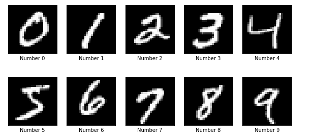

This was my first project, I used a neural network (CNN) to classify handwritten digits. The MNIST dataset comprises 60,000 training examples and 10,000 test examples of the handwritten digits 0–9, formatted as 28x28-pixel monochrome images. The dataset is public and you can download it using [data_Downloader](https://github.com/maurehur/data_downloader.git) repository.

